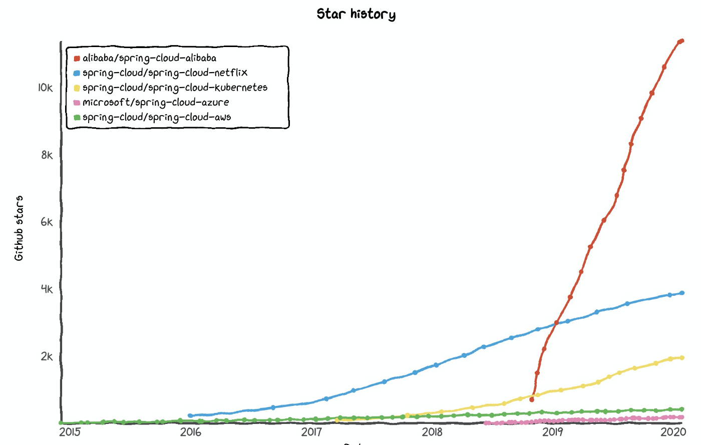
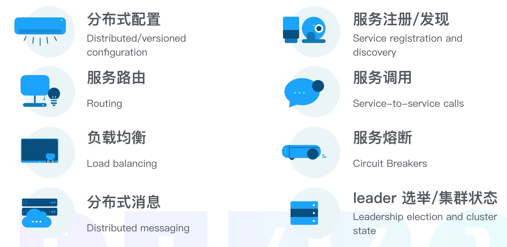
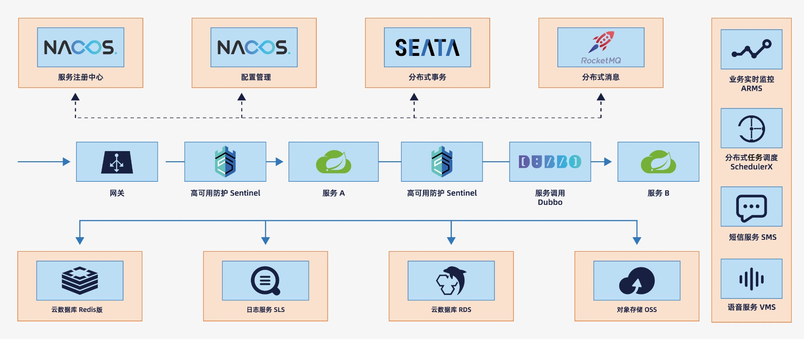
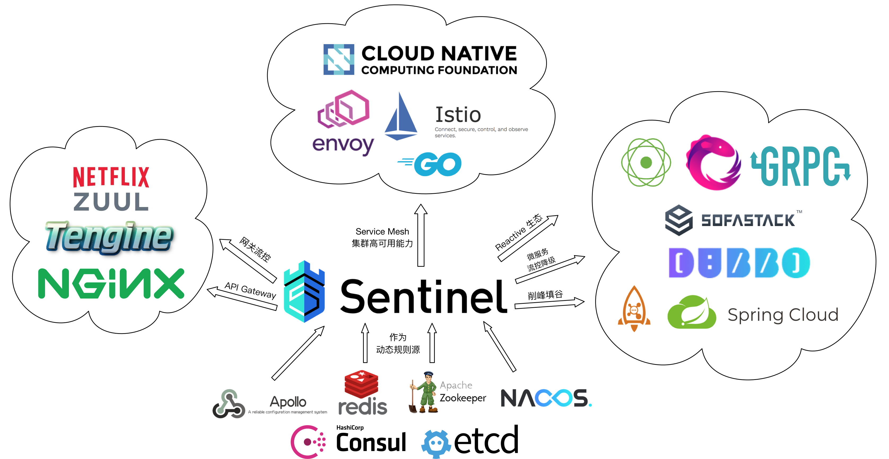

# Spring Cloud Alibaba Boilerplate

[English](README.md)

[中文文档](README-zh_cn.md)

## 概述

此项目基于 [spring-cloud-alibaba](https://spring.io/projects/spring-cloud-alibaba)，目标是快速展示 Spring Cloud Alibaba 组件能力。

主要代码来自 [官方示例](https://github.com/alibaba/spring-cloud-alibaba/tree/master/spring-cloud-alibaba-examples)。

## 开发中 ...

此项目目前只展示 SCA 相应开发组件，可快速运行。重点用于学习，目前非生产可用。

生产可用框架，推荐关注 🚀[steam-cloud](https://github.com/rosky/steam-cloud) ：不只是一个微服务快速开发框架。

# 入门

## 准备工作

### 开发环境

* Linux

* JAVA 8

* IntelliJ IDEA IDE

### Sentinel

* 在[这里](http://edas-public.oss-cn-hangzhou.aliyuncs.com/install_package/demo/sentinel-dashboard.jar)下载 DEMO 版文件

* 在[这里](https://github.com/alibaba/Sentinel/releases)下载 正式 版文件

运行：

```
java -jar sentinel-dashboard.jar
```

管理控制台：

正式版默认登陆:

* 用户名: sentinel

* 密码: sentinel

```
http://127.0.0.1:8080/
```

### Nacos

* 在[这里](https://github.com/alibaba/nacos/releases)下载 正式 版文件

运行：

```
unzip nacos-server-1.0.0.zip
cd nacos/bin
sh startup.sh -m standalone
```

管理控制台：

```
http://127.0.0.1:8848/nacos
```

### RocketMQ

* 在[这里](https://github.com/apache/rocketmq/releases)下载 正式 版文件

运行：

```
unzip rocketmq-all-4.7.0.zip
cd rocketmq-all-4.7.0

# Startup Name Server
sh bin/mqnamesrv

# Startup Broker
sh bin/mqbroker -n localhost:9876

# Create topic: test-topic
sh bin/mqadmin updateTopic -n localhost:9876 -c DefaultCluster -t test-topic
```

## Start projects

已测试运行正常:
```
SentinelServiceApplication :28083/
NacosDiscoveryConsumerSCLBApplication :18083/
DemoApplication :58070/
DubboSpringCloudServletGatewayBootstrap :61178/
DubboSpringCloudWebProviderBootstrap :9090/
NacosGatewayDiscoveryApplication :18085/
RocketMQBusApplication :38080/
SentinelDubboConsumerApp
SentinelDubboProviderApp
SentinelSpringCloudGatewayApplication :28085/
SentinelWebFluxApplication :28084/
SentinelZuulApplication :28086/
SpringCloudConfigClientApplication :28080/
SpringCloudConfigServerApplication :7070/
RocketMQConsumerApplication
SentinelFeignConsumerApplication :18087/
SentinelFeignProviderApplication :18088/
RocketMQProducerApplication :38081/
NacosConfigApplication :18084/
```

未测试:

```
DubboSpringCloudClientBootstrap
DubboSpringCloudConsumerBootstrap
DubboSpringCloudProviderBootstrap
DubboSpringCloudServerBootstrap
```

## Reference

趋势（影响我们选择 SCA 的重要因素）:



主要特性:



架构图:



Sentinel 特性:


Sentinel 开源生态:



## 贡献人员

还缺你。
